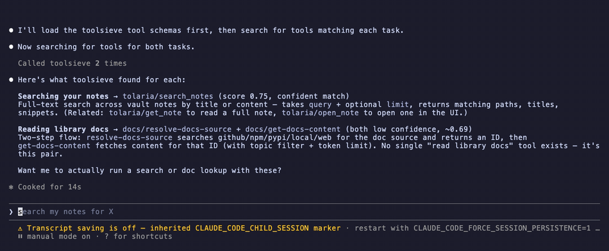

# toolsieve

**Semantic tool routing for MCP.** Point it at the MCP servers you already run.
It aggregates every tool they publish, then exposes exactly **three** tools to
your client — and tells you how many tokens that saved.



*Claude Code (Sonnet) against 4 real MCP servers — 15 tools aggregated, 3 exposed.
It routes "search my notes" and "read library docs" to the right tools, calls the
weather tool for real, and reports **4,286 tokens saved (79.7%)** across the session.*

## Why

Every MCP server you connect dumps its full tool list — names, descriptions, and
JSON schemas — into your model's context on every single request. Five servers in,
you're spending thousands of tokens per call describing tools you won't use.

Existing MCP gateways and proxies solve this by filtering **lexically** (BM25
keyword matching) or **structurally** (manual allow-lists). toolsieve matches
**semantically**: it embeds each tool's own name and description, embeds your
query, and returns the closest matches by cosine similarity. Ask for "what's the
weather" and it finds `get_weather` — no keyword overlap required.

And it shows its work. Every response carries a token-savings receipt.

## How it works

```
   your MCP client
         │  sees only: find_tools, call_tool, get_savings_report
         ▼
    ┌─────────────┐
    │  toolsieve  │  embeds each tool's name + description once
    └─────────────┘  matches your query by cosine similarity
       │    │    │
       ▼    ▼    ▼     real stdio MCP servers, connections held open
     docs weather notes
```

1. **`find_tools(query, k=3)`** — returns the closest matching tools, each with
   its owning server, description, and full input schema, plus the savings receipt.
2. **`call_tool(server, tool_name, args)`** — proxies the real call to the server
   that owns it and returns the real result.
3. **`get_savings_report()`** — running session total.

Two steps rather than one, deliberately: a router can't reliably invent valid
arguments from free text. You see the real schema before you call.

## Install

Requires Python 3.11+ and [uv](https://docs.astral.sh/uv/).

```bash
git clone https://github.com/TJLSmith0831/toolsieve
cd toolsieve
uv sync
```

### Configure

Create `toolsieve.config.json`. It's the same `mcpServers` shape Claude Desktop
and Claude Code use, so entries are usually copy-pasteable from a config you
already have:

```json
{
  "mcpServers": {
    "docs":    { "command": "node", "args": ["/path/to/docs-mcp/dist/index.js"] },
    "weather": { "command": "node", "args": ["/path/to/weather-mcp/dist/index.js"] },
    "notes":   { "command": "uv",   "args": ["run", "--directory", "/path/to/notes-mcp", "python", "src/index.py"] }
  }
}
```

Edit this file while toolsieve is running and it re-aggregates automatically —
no restart.

### Run

As an MCP server, from any client:

```json
{
  "mcpServers": {
    "toolsieve": {
      "command": "uv",
      "args": ["run", "--directory", "/path/to/toolsieve", "python", "-m", "toolsieve"],
      "env": { "TOOLSIEVE_CONFIG": "/path/to/toolsieve.config.json" }
    }
  }
}
```

Or see it work end to end. With no config, this runs against two real stdio MCP
servers the repo ships, so it works on a fresh clone with nothing else installed:

```bash
uv run python demo.py
```

Savings look modest on that 4-tool demo catalog — routing 3 of 4 tools can't save
much. Point `TOOLSIEVE_CONFIG` at your own servers to see the real number.

### Claude Code

```
/plugin marketplace add TJLSmith0831/toolsieve
/plugin install toolsieve
```

The plugin reads its server list from `~/.toolsieve/config.json` — a home-directory
path, so it survives plugin updates.

## Configuration

| Variable | Default | Purpose |
|---|---|---|
| `TOOLSIEVE_CONFIG` | `toolsieve.config.json` | Path to the `mcpServers` config |
| `TOOLSIEVE_CONFIDENCE_THRESHOLD` | `0.70` | Below this, matches are flagged `confidence: "low"` |
| `TOOLSIEVE_LOG_LEVEL` | `WARNING` | Set `INFO` to see aggregation and match logging |

## Behavior worth knowing

**Match quality depends on your downstream tools' descriptions.** toolsieve embeds
what each server publishes — it does not rewrite it. A tool described as `"runs the
thing"` will match poorly, and that's a property of the tool, not the router.
toolsieve warns at startup about tools with no description at all.

**A weak match is flagged, not withheld.** Measured against a real catalog,
on-topic queries score roughly 0.56–0.83 and off-topic ones 0.38–0.55 — the ranges
nearly touch, so no threshold cleanly separates them. Rather than tell you "nothing
matched" while a perfectly good tool exists, toolsieve returns its best match and
tags anything under the threshold `confidence: "low"`. You see the score and the
schema, so you can judge. If a match is wrong, call again with
`exclude=["server/tool_name"]`.

**One server going down doesn't take toolsieve with it.** A server that fails to
connect is logged and skipped; the rest of the catalog still works. A call to a
failed server returns an error naming that server. A missing or broken config
starts toolsieve with an empty catalog rather than crashing — fix the file and it
loads with no restart.

**Savings scale with catalog size.** Routing k=3 out of 3 tools saves nothing;
out of 15 it saves ~80%. Token counts are estimates (~4 chars/token), but
`saved_pct` is exact — both sides are measured identically, so the estimator
cancels out.

## Development

```bash
uv run pytest -q
```

Tests run against real stdio MCP servers, not mocks.

## License

[MIT](LICENSE)
